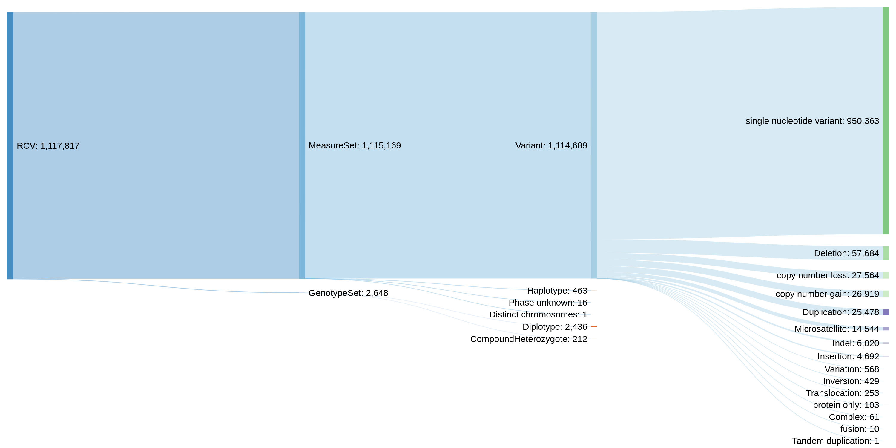

# ClinVar data model and variant types

The script in this directory parses ClinVar XML types and calculates statistics on all possible ways the variants can be represented. The results are described below.

## Running the script

```bash
wget https://ftp.ncbi.nlm.nih.gov/pub/clinvar/xml/ClinVarFullRelease_00-latest.xml.gz
python3 \
  clinvar-variant-types.py \
  --clinvar-xml ClinVarFullRelease_00-latest.xml.gz
```

## Results

Generated from the file `ClinVarFullRelease_2020-0706.xml.gz` (click to enlarge):



**RCV** is the top level of ClinVar data organisation. It is a record which associates one or more traits (usually diseases) with exactly one _VCV record,_ which can be one of two types:
* **MeasureSet** contains one or more _Measures_ (which are basically individual, isolated variants). Its type can be one of four values:
  - **Variant.** This means that the measure “set” has the length of 1 and contains just a single isolated variant. This variant can be one of the following subtypes, listed in the decreasing order of occurrence:
    + single nucleotide variant
    + Deletion
    + copy number loss
    + copy number gain
    + Duplication
    + Microsatellite
    + Indel
    + Insertion
    + Variation
    + Inversion
    + Translocation
    + protein only
    + Complex
    + fusion
    + Tandem duplication
  - Three other complex types, which were not investigated further in this analysis. They may contain multiple Measures (variants), which must all be interpreted together:
    + **Haplotype.** A collection of variants phased on the same chromosome copy and usually inherited together.
    + **Phase unknown**
    + **Distinct chromosomes**
* **GenotypeSet** represents the cases when the variants which are interpreted together are located on different chromosomal copies (paternal/maternal), that is, when they include _trans_ phasing. The GenotypeSet can be one of two types, which were not investigated further in this analysis:
  - **CompoundHeterozygote.** Presumably this should include exactly two variants which are _trans_ phased and interpreted together.
  - **Diplotype.** Similar, but at least one of the _trans_ phased alleles includes a haplotype. An example of this would be three variants located on one copy of the gene, and one variant in the second one, all interpreted together.

The most common case is the MeasureSet/Variant one, accounting for 1114689 out of 1115169 RCV records (as of the date when this report was compiled), or 99.96%.
