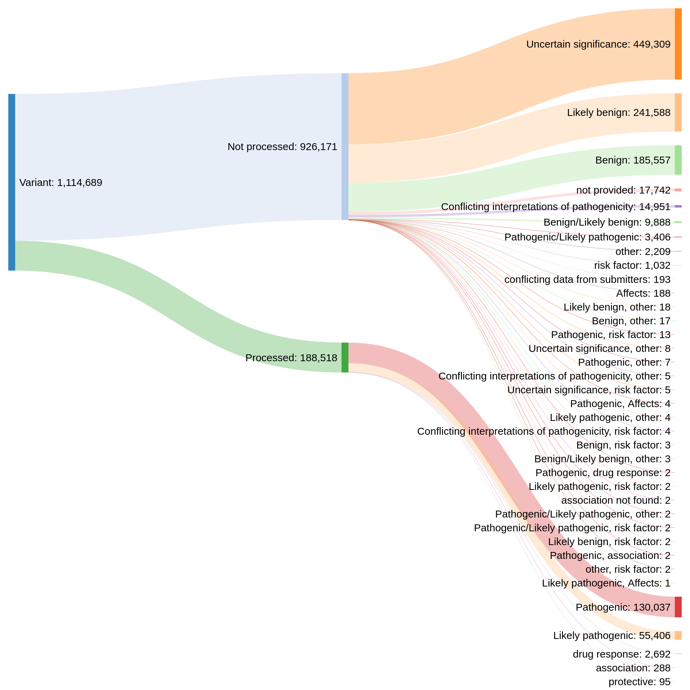
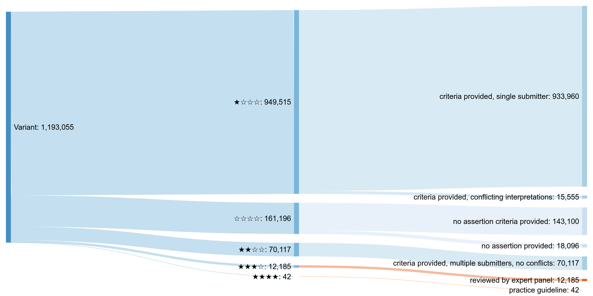
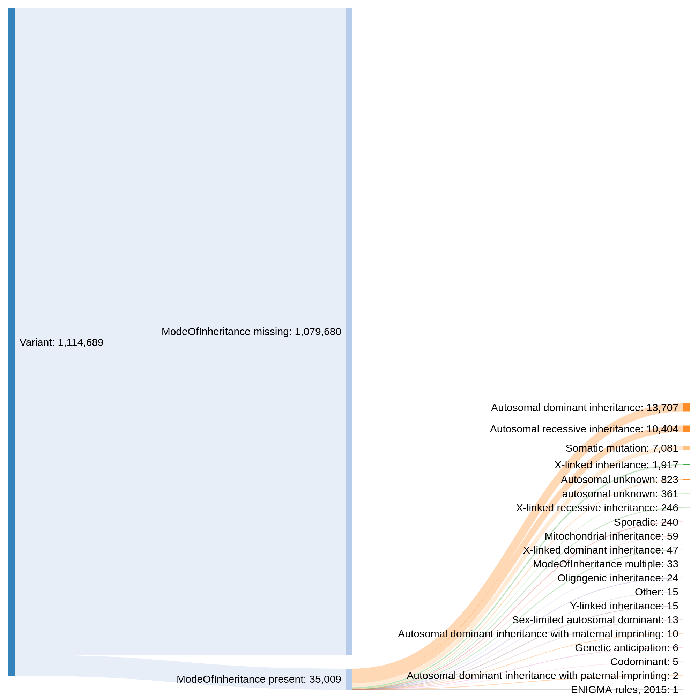
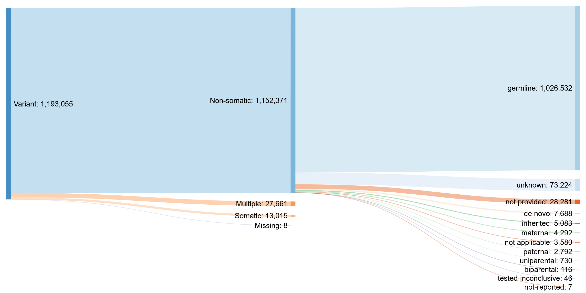

# ClinVar data model and attribute value distributions

The script in this directory parses the ClinVar XML data dump and constructs several diagrams and tables which illustrate how variation and disease data are represented. This helps guide the design of the pipeline and its output structure.

The data was last updated on **2021-03-12.** Graphs can be enlarged by clicking on them.


## Updating the data

```bash
wget https://ftp.ncbi.nlm.nih.gov/pub/clinvar/xml/ClinVarFullRelease_00-latest.xml.gz
python3 clinvar-variant-types.py --clinvar-xml ClinVarFullRelease_00-latest.xml.gz
```

The source code for diagrams and tables will be printed to STDOUT. The diagrams can then be built using the website http://sankeymatic.com/build/. Parameters for rendering them will be indicated in the output as well. The tables should be copy-pasted in this Markdown report directly.


## Variation representation


**RCV** is the top level of ClinVar data organisation. It is a record which associates one or more traits (usually diseases) with exactly one _VCV record,_ which can be one of two types:
* **MeasureSet** contains one or more _Measures._ (Each Measure is essentially an individual, isolated variant.) The MeasureSet can be one of four types:
  - **Variant.** This means that the measure “set” has the size of 1 and contains just a single isolated variant. This variant can be one of the following subtypes, listed in the decreasing order of occurrence:
    + single nucleotide variant
    + Deletion
    + copy number loss
    + copy number gain
    + Duplication
    + Microsatellite
    + Indel
    + Insertion
    + Variation
    + Inversion
    + Translocation
    + protein only
    + Complex
    + fusion
    + Tandem duplication
  - Three other complex types, which were not investigated further in this analysis. They may contain multiple Measures (variants), which must all be interpreted together:
    + **Haplotype.** A collection of variants phased on the same chromosome copy and usually inherited together.
    + **Phase unknown**
    + **Distinct chromosomes**
* **GenotypeSet** represents the cases when the variants which are interpreted together are located on different chromosomal copies (paternal/maternal), that is, when they include _trans_ phasing. The GenotypeSet can be one of two types, which were not investigated further in this analysis:
  - **CompoundHeterozygote.** Presumably this should include exactly two variants which are _trans_ phased and interpreted together.
  - **Diplotype.** Similar, but at least one of the _trans_ phased alleles includes a haplotype. An example of this would be three variants located on one copy of the gene, and one variant in the second one, all interpreted together.

As of 2021-03-12, the most common case is the MeasureSet/Variant one, accounting for 1,193,055 out of 1,196,231 RCV records, or >99.7%. **Currently, this is the only type being processed by this pipeline.** All following diagrams also examine distributions only within that record type.


## Clinical significance



Clinical significance can be either “Simple” (only one level present per a Variant record) or “Complex” (multiple levels are present, separated by slashes and/or commas).

### Complex clinical significance levels

This is simply the part of the distribution which is not shown on the diagram above for readability.

Clinical significance|Count
:--|:--
Benign/Likely benign|10153
Pathogenic/Likely pathogenic|4375
Benign, other|17
Likely benign, other|17
Pathogenic, risk factor|14
Pathogenic, other|8
Uncertain significance, other|8
Conflicting interpretations of pathogenicity, other|7
Uncertain significance, risk factor|6
Pathogenic, Affects|4
Likely pathogenic, other|4
Benign/Likely benign, other|3
Benign, risk factor|3
Pathogenic, drug response|2
Likely pathogenic, risk factor|2
Conflicting interpretations of pathogenicity, association, risk factor|2
Conflicting interpretations of pathogenicity, risk factor|2
Likely benign, risk factor|2
Pathogenic, association|2
Pathogenic/Likely pathogenic, other|2
other, risk factor|2
Benign/Likely benign, risk factor|1
Pathogenic/Likely pathogenic, risk factor|1
Conflicting interpretations of pathogenicity, association|1
Pathogenic/Likely pathogenic, association|1
Uncertain significance, Affects|1
Likely pathogenic, Affects|1

### All clinical significance levels

For the purposes of this table, the complex clinical significance levels are split, and each component is counted. Because of this, the total will be higher than the total number of Variant records.

Clinical significance|Count
:--|:--
Uncertain significance|497158
Likely benign|253500
Benign|199727
Pathogenic|148997
Likely pathogenic|67409
not provided|18096
Conflicting interpretations of pathogenicity|15887
drug response|2722
other|2283
risk factor|1065
association|365
Affects|195
conflicting data from submitters|193
protective|94
confers sensitivity|13
association not found|2


## Star rating and review status

These fields reflect the strength of evidence supporting the assertion of variant/disease association contained in the ClinVar record.



### Distribution of records by star rating
Star rating|Count
:--|:--
☆☆☆☆|161196
★☆☆☆|949515
★★☆☆|70117
★★★☆|12185
★★★★|42


## Mode of inheritance



Only a small fraction of all records specify their mode of inheritance: 35,009 out of 1,114,689, or about 3%.


## Allele origin



All records specify an allele origin. It can be either a single value (the majority of them) or multiple ones.
