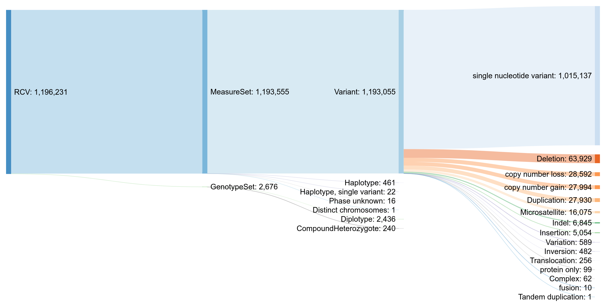
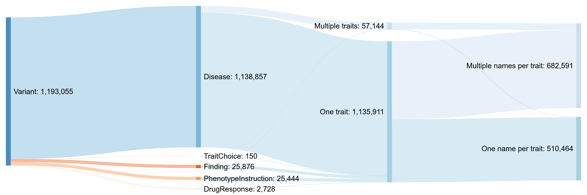
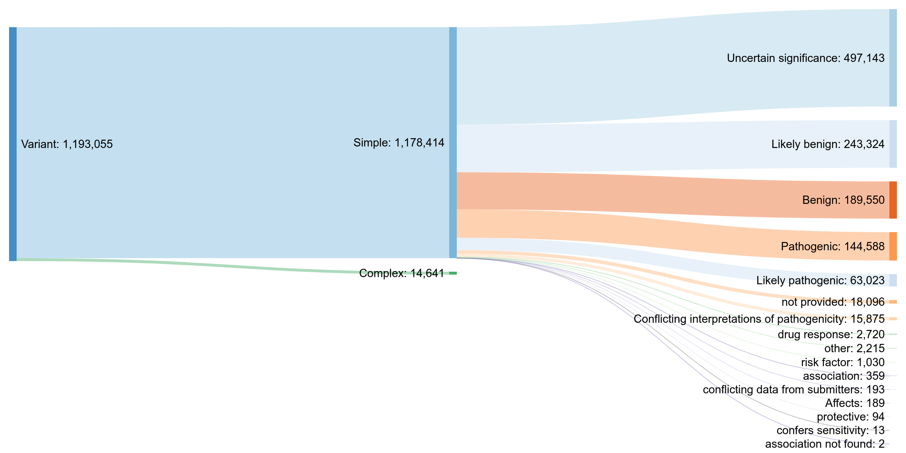
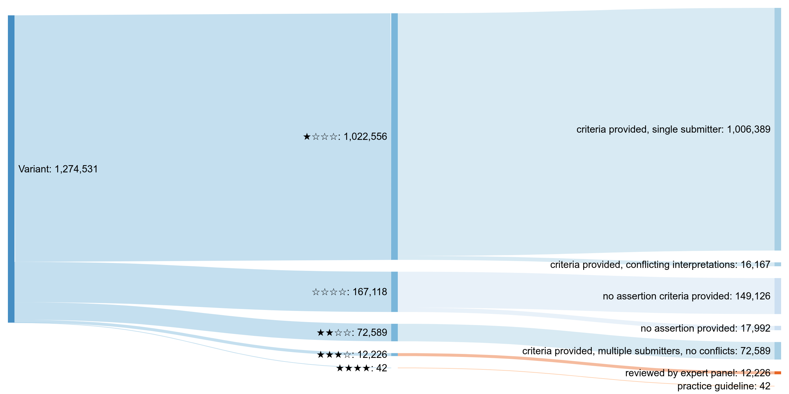
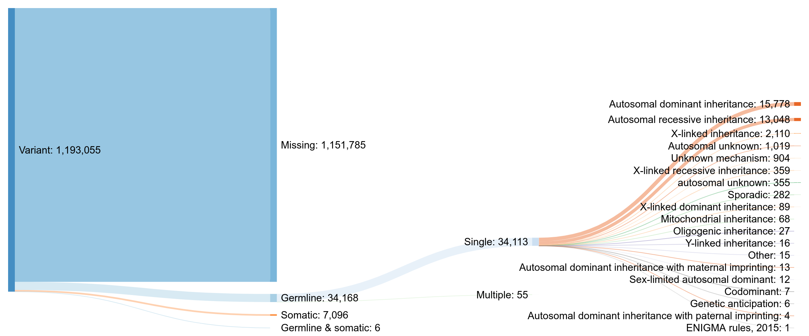
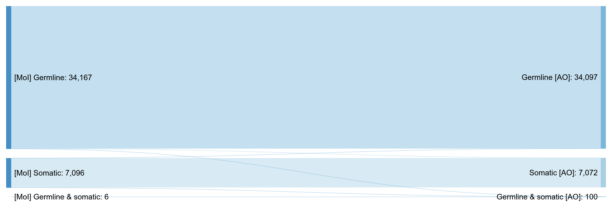

# ClinVar data model and attribute value distributions

The script in this directory parses the ClinVar XML data dump and constructs several diagrams and tables which illustrate how variation and disease data are represented. This helps guide the design of the pipeline and its output structure.

The data was last updated on **2021-03-19.** Graphs can be enlarged by clicking on them.


## Updating the data

```bash
wget https://ftp.ncbi.nlm.nih.gov/pub/clinvar/xml/ClinVarFullRelease_00-latest.xml.gz
python3 clinvar-variant-types.py --clinvar-xml ClinVarFullRelease_00-latest.xml.gz
```

The source code for diagrams and tables will be printed to STDOUT. The diagrams can then be built using the website http://sankeymatic.com/build/. Parameters for rendering them will be indicated in the output as well. The tables should be copy-pasted into the [corresponding Markdown file](supplementary-tables.md).


## Variation representation



**RCV** is the top level of ClinVar data organisation. It is a record which associates one or more traits (usually diseases) with exactly one _VCV record,_ which can be one of two types:
* **MeasureSet** contains one or more _Measures._ (Each Measure is essentially an individual, isolated variant.) The MeasureSet can be one of four types:
  - **Variant.** This means that the measure “set” has the size of 1 and contains just a single isolated variant. This variant can be one of the subtypes illustrated on the diagram.
  - Three other complex types, which were not investigated further in this analysis. They may contain multiple Measures (variants), which must all be interpreted together:
    + **Haplotype.** A collection of variants phased on the same chromosome copy and usually inherited together.
    + **Phase unknown**
    + **Distinct chromosomes**
* **GenotypeSet** represents the cases when the variants which are interpreted together are located on different chromosomal copies (paternal/maternal), that is, when they include _trans_ phasing. The GenotypeSet can be one of two types, which were not investigated further in this analysis:
  - **CompoundHeterozygote.** Presumably this should include exactly two variants which are _trans_ phased and interpreted together.
  - **Diplotype.** Similar, but at least one of the _trans_ phased alleles includes a haplotype. An example of this would be three variants located on one copy of the gene, and one variant in the second one, all interpreted together.

As of 2021-03-19, the most common case is MeasureSet/Variant, accounting for 1,193,055 out of 1,196,231 RCV records, or >99.7%. **Currently, this is the only type being processed by this pipeline.** All following diagrams also examine distributions only within that record type.


## Trait representation



The diagram above demonstrates two properties for each Variant record:
* Whether it contains no trait records, one record, or multiple;
* Whether at least one of the trait records contains more than one name.

Only traits of type “Disease” are processed by the pipeline and demonstrated in this diagram.


## Clinical significance



Clinical significance can be either “Simple” (only one level present per Variant record) or “Complex” (multiple levels are present, separated by slashes and/or commas).

Supplementary tables:
* [**Complex clinical significance levels**](supplementary-tables.md#complex-clinical-significance-levels). This is simply the part of the distribution which is not shown on the diagram above for readability.
* [**All clinical significance levels.**](supplementary-tables.md#all-clinical-significance-levels) This is the cumulative count for both simple and complex cases. For complex cases, the levels are split and counted individually. Hence, the total in this table will be higher than the total number of Variant records.


## Star rating and review status

These fields reflect the strength of evidence supporting the assertion of variant/disease association contained in the ClinVar record.



### Distribution of records by star rating
Star rating|Count
:--|:--
☆☆☆☆|161196
★☆☆☆|949515
★★☆☆|70117
★★★☆|12185
★★★★|42


## Mode of inheritance



Only a small fraction of all records specify their mode of inheritance: 41,270 out of 1,193,055, or about 3.5%. The possible scenarios can be broadly divided into four categories: missing values; germline (single or multiple values); somatic; germline & somatic mixed (multiple values).

Supplementary table: [**Records with multiple mode of inheritance values.**](supplementary-tables.md#records-with-multiple-mode-of-inheritance-values)


## Allele origin


All Variant records, save for a few, specify an allele origin. The values can be divided in the same broad categories as modes of inheritance.

Supplementary table: [**Records with multiple allele origin values.**](supplementary-tables.md#records-with-multiple-allele-origin-values)


## Mapping between mode of inheritance and allele origin

In theory, for single values the categories of mode of inheritance and allele origin (germline / somatic / germline & somatic) must always be the same. The following diagram illustrates the mapping from one to the other in practice. For readability, it shows only the records where *both* allele origin and mode of inheritance are present:



The majority of records can be seen to conform to the rules. For the list of exceptions, see supplementary table: [**Records with inconsistent mode of inheritance and allele origin values.**](supplementary-tables.md#records-with-inconsistent-mode-of-inheritance-and-allele-origin-values)
